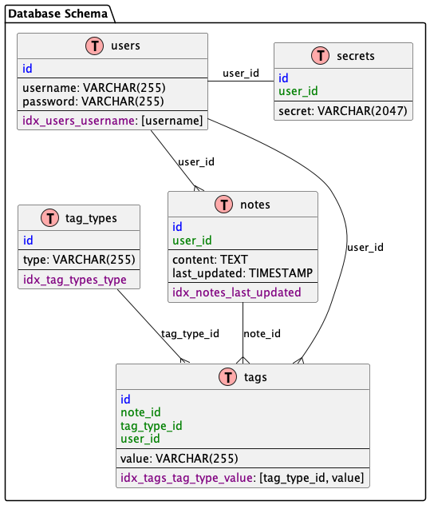

- #### Concepts
  - Note: a String
  - Tag: extracted data from note
- __Example__:
    
```js
const noteStrings = [
  "Another related note: <noteID:8080>",
  "Task: <todo:0>",
  "Meeting on <date:2023-06-02>",
  "Project deadline: <deadline:2023-07-14>",
  "Feeling: <mood:happy>",
  "Title: <title:restify-js>",
  "Recipe: <ingredient:flour> <ingredient:sugar> <ingredient:egg>",
  "Status: <status:in-progress>",
];

```
  - __Query__ (pseudo code):
```js
const conditions = [
  { type: 'ingredient', value: 'flour', operator: '=' },
  { type: 'ingredient', value: 'sugar', operator: '=' },
  { type: 'ingredient', value: 'egg', operator: '=' },
];
find(conditions);
// return all notes with the ingredients flour, sugar, and egg
// [ {id: XXX, content: "Recipe: <ingredient:flour> <ingredient:sugar> <ingredient:egg>" } ]
```
  - __Result__:
```js
```

- #### Data Structure
  - Note: 
    - id : unique INT
    - content: TEXT
    - tags: \[ Tag ]
  - Tag: 
    - type: VARCHAR(255)
    - value: VARCHAR


